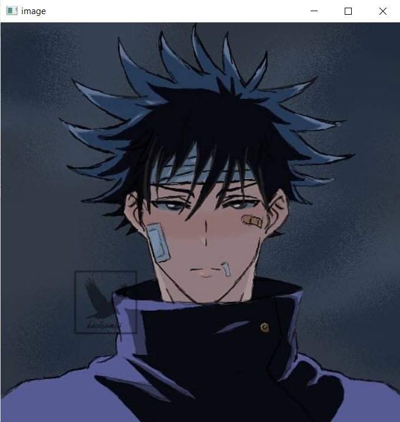
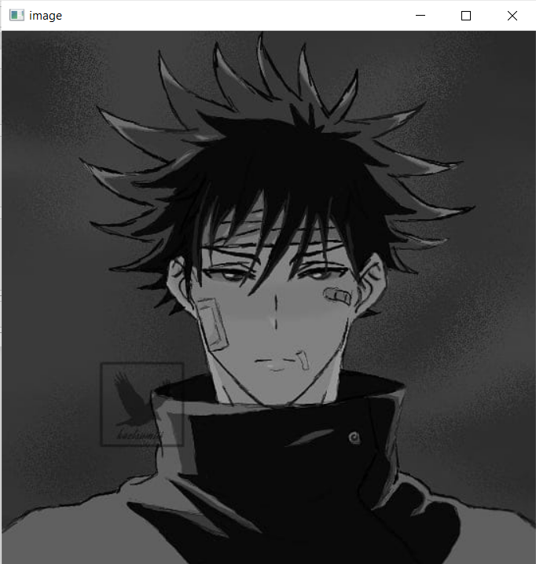
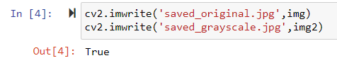
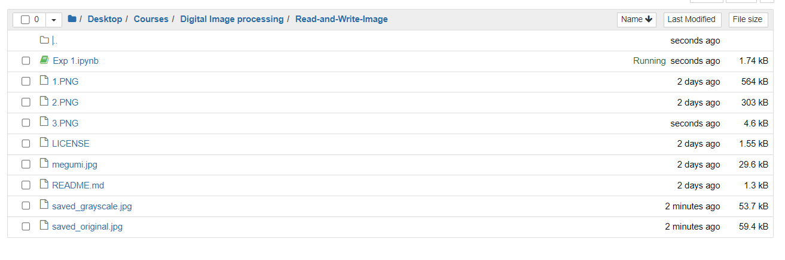
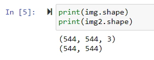
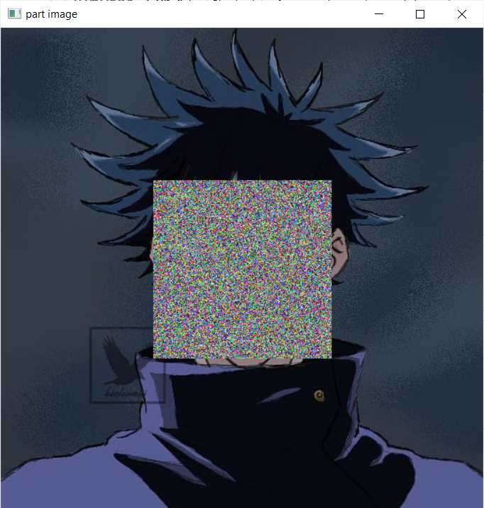

Exp.No : 01 
&emsp;
&emsp;
&emsp;
&emsp;
&emsp;
&emsp;
&emsp;
&emsp;
&emsp;
&emsp;
&emsp;
&emsp;
&emsp;
&emsp;
&emsp;
&emsp;
&emsp;
&emsp;
&emsp;
&emsp;
&emsp;
&emsp;
Date : 15.03.2023 
<br>

# READ AND WRITE AN IMAGE
## AIM

-  To write a python program using OpenCV to do the following image manipulations.
    1. Read, display, and write an image.
    2. Access the rows and columns in an image.
    3. Cut and paste a small portion of the image.

## Software Required:
Anaconda - Python 3.7

## Algorithm:
- **Step1:** Choose an image and save it as a filename.jpg
- **Step2:** Use imread(filename, flags) to read the file.
- **Step3:** Use imshow(window_name, image) to display the image.
- **Step4:** Use imwrite(filename, image) to write the image.
- **Step5:** End the program and close the output image windows.

## Program:

> Developed By: Kaushika A    
> Register Number: 212221230048

**i) To Read,display the image**
```python
# displaying image in color
img=cv2.imread("megumi.jpg",1) 
cv2.imshow("image",img)
cv2.waitKey(0)
cv2.destroyAllWindows()
```

```python
# displaying image in grayscale
img2=cv2.imread("megumi.jpg",0)
cv2.imshow("image",img2)
cv2.waitKey(0)
cv2.destroyAllWindows()
```
**ii) #To write the image**
```python
cv2.imwrite('saved_original.jpg',img)
cv2.imwrite('saved_grayscale.jpg',img2)
```
**iii) Find the shape of the Image**
```python
print(img.shape)
print(img2.shape)
```
**iv) To access rows and columns**
```python
import random
for i in range(172,373):
    for j in range(172,373):
        img[i][j]=[random.randint(0,255),random.randint(0,255),random.randint(0,255)]
cv2.imshow('part image',img)
cv2.waitKey(0)
cv2.destroyAllWindows()
```
**v) To cut and paste portion of image**
```python
img3=cv2.imread("megumi.jpg",1)
cut=img3[172:221,172:373]
img3[221:270,172:373]=cut
cv2.imshow('212221230048',img3)
cv2.waitKey(0)
cv2.destroyAllWindows()
```

## Output:

## i) Read and display the image
### original image


### grayscale image


## ii)Write the image


### saved image in folder


## iii)Shape of the Image


## iv)Access rows and columns


## v)Cut and paste portion of image


## Result:
Thus the images are read, displayed, and written successfully using the python program.


